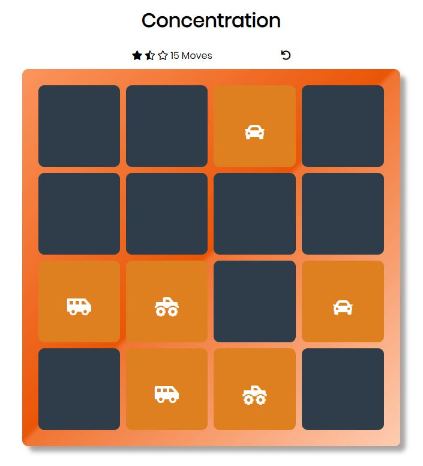
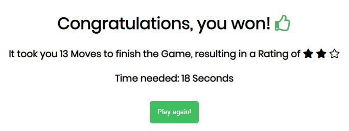

# Memory-Card-Game

During my [Frontend Nanodegree Course from Udacity](https://eu.udacity.com/course/front-end-web-developer-nanodegree--nd001?gclid=EAIaIQobChMIqs2G_rWq3wIVA8AYCh1nPg4mEAAYASAAEgLGYPD_BwE)
I developed a browser based version of the Memory Card Game (also known as
Concentration). The concept of the game is to find all pairs of cards that
exist on the board - the tricky part is that you're only allowed to see two
cards at once from the cards that are left. You have to memorize where which card lies
on the board in order to get a good rating.  

  

Depending on how well you do in the Game, you will receive a certain amount of stars as a
rating in the ending screen. The better you play, the more stars you'll receive.

### How to Play
As stated, the goal is to match all cards together in the least possible steps.
To do so, you can play the game by taking following actions:
1. Start by clicking on two cards (initially, this can be completely random as no player 
has any knowledge about the board so far).
2. If the cards are pairs, they will stay flipped and won't be in the active game no more.
Otherwise, you should memorize what the value has been of the cards.
3. Match up all pairs until each pair has been found.
4. Once finished, the Game will redirect you onto another page which shows you your personal
statistics for the past game. If you want to, you can choose to play another game.

Additionally, keep in mind that you can reset the game anytime by hitting the reset button.

### How to Install
Starting the application on your local machine is **really easy**. Just clone or download
this repository (if necessary, unzip the files) and load the app.html into your browser (e.g. via double-click).
Have fun playing the game, and try to beat my best score (see ending screen above)! :)